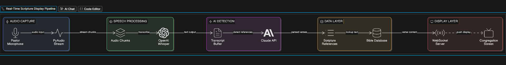

# ScriptureAI  Real-Time Pastor Speech to Scripture Display
An open-source AI tool that listens to a pastor’s sermon in real time, automatically detects Bible scripture references, and displays them on screen  eliminating the need for manual media team intervention

# The Problem
In churches worldwide, the media team manually searches for and displays Bible scriptures as the pastor preaches. This process is:
- Slow 
- Error-prone 
- Stressful 
- Distracting 

# The Solution
ScriptureAI listens to the pastor’s voice in real time, uses AI to detect when a scripture is being quoted or referenced, and automatically pushes the correct scripture text to the display screen  in approximately 2-4 seconds.

# The Architrecture 


# Tech Stack
| Component          | Technology              |
|------------------|-------------------------- |
| Audio Capture     | PyAudio                  |
| Speech to Text    | OpenAI Whisper           |
| AI Detection      | Anthropic Claude API     |
| Display Server    | FastAPI + WebSockets     |
| Bible Database    | SQLite (local)           |
| Configuration     | Python dotenv            |


# Installation
## Prerequites
- Python 3.12.5
- A microphone connected to your computer
- Anthropic API key (get one at console.anthropic.com)

## Clone the repository
```bash
git clone https://github.com/BlacksheepAnalytics113/Scripture_AI.git
```

## Create virtual environment
```bash
python -m venv venv
source venv/bin/activate 
```

##  Install dependencies
```bash
pip install -r requirements.txt
```

## Set up environment variables
```bash
cp .env.example .env 
```

## Set up the Bible database
```bash
python Utils/Bible_db.py
```

## Run the application
```bash
python main.py
```

##  Open the display screen
```bash
Open your browser and go to: http://localhost:8000/display
Put this on the projector screen. It will automatically update as scriptures are detected.
```

## Testing Without a Microphone
You can test the scripture detection without audio:
```bash
python Utils/detector.py
```